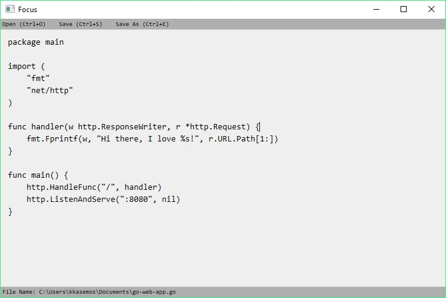


## Focus

A text editor has font and background based on the style of the snippet code box used in Go package document, ex. [net/http](https://golang.org/pkg/net/http/).

It supports the following functions:

- Open file (Control+O)
- Save (Control+S)
- Save as (Control+E)
- Display editing file name on the bottom of the window.

Since it is developed using the TextBox WPF component thus; the basic shortcut keys supported such as Cut (Control+X), Select All (Control+A).

## Background

I very like the style of the snippet code box and tried to find a text editor that has the same style with a very small set of functions however I found none thus; I developed it.